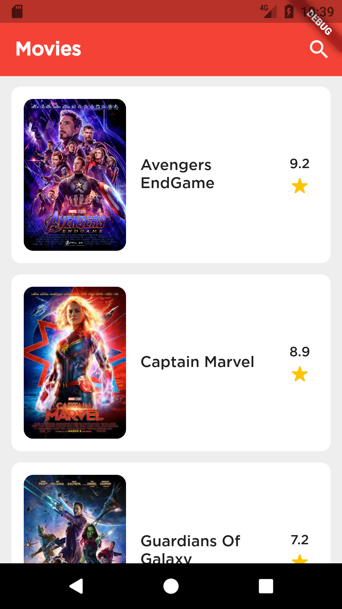
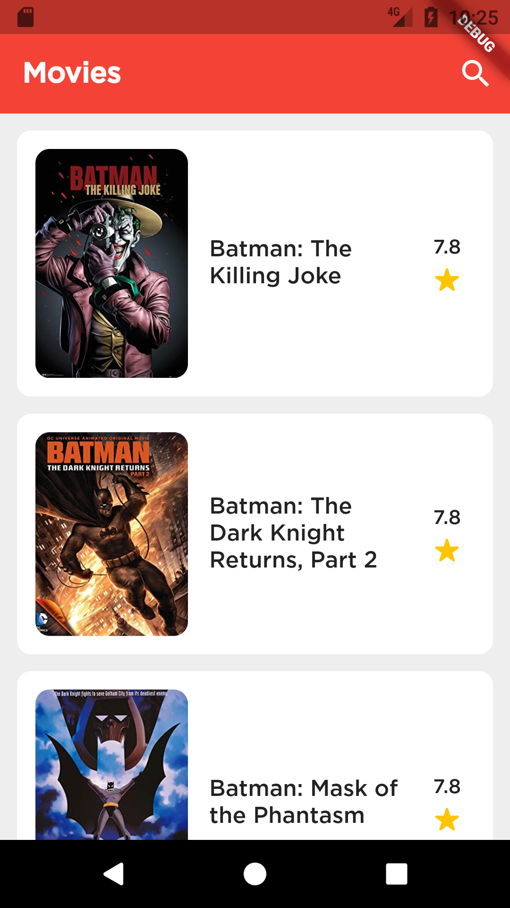

# Movies Info App

A new Flutter project.

## API Used in Project
### OMDb API - The Open Movie Database

The OMDb API is a RESTful web service to obtain movie information, all content and images on the site are contributed and maintained by our users.

Usage
Send all data requests to:
```
http://www.omdbapi.com/?apikey=[yourkey]&
```
Poster API requests:
```
http://img.omdbapi.com/?apikey=[yourkey]&
```

## Screenshots
ListView From Asset       | ListView From API 
:-------------------------|:-------------------------
  |  

---
## Getting Started

This project is a starting point for a Flutter application.

A few resources to get you started if this is your first Flutter project:

- [Lab: Write your first Flutter app](https://flutter.dev/docs/get-started/codelab)
- [Cookbook: Useful Flutter samples](https://flutter.dev/docs/cookbook)

For help getting started with Flutter, view our
[online documentation](https://flutter.dev/docs), which offers tutorials,
samples, guidance on mobile development, and a full API reference.

